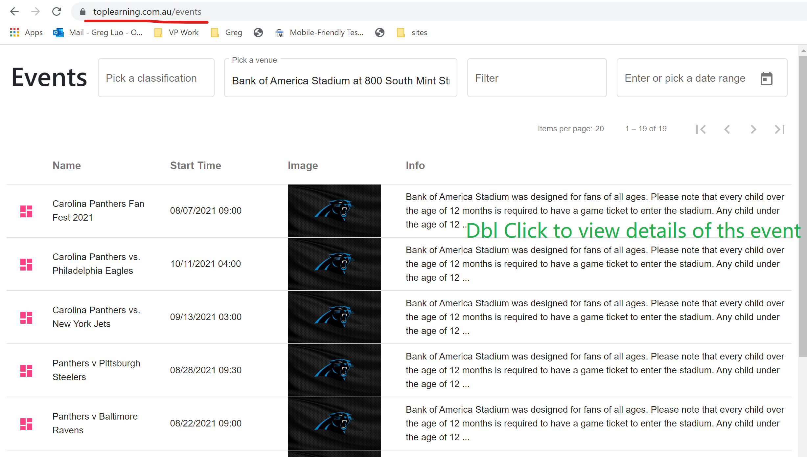

# TicketMaster by GregLuo(0406518207)

Implemented with Angular 12 and Material Design

## Play it directly

Open the URL  `https://toplearning.com.au/events` to use it. Have fun!

## Run the simulator

Run `yarn`, then `ng serve` for a dev server. Navigate to `http://localhost:4200/`.

## Running unit tests

Run `ng test` to execute the unit tests.

